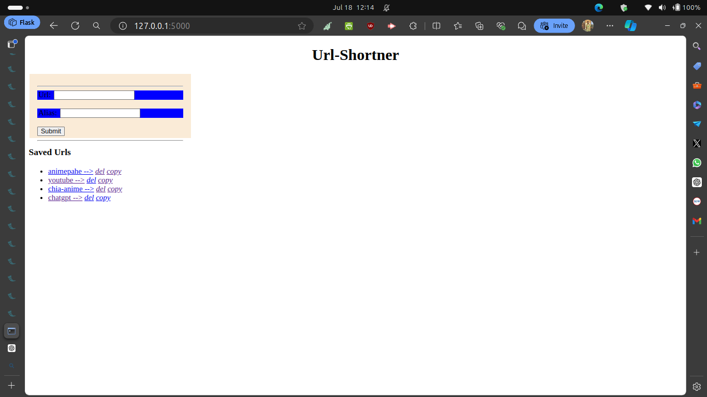
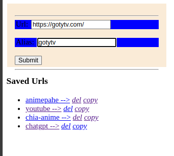

# URL Shortener App

Welcome to the URL Shortener App, a simple web application built with Flask that allows users to create, save, delete, and copy shortened URLs to the clipboard.

## Table of Contents

-  [Features](#features)
-  [Screenshots](#screenshots)
-  [Installation](#installation)
-  [Usage](#usage)
-  [API Endpoints](#api-endpoints)
-  [Contributing](#contributing)
-  [License](#license)

## Features

-  **Create Short URLs**: Easily create aliases for URLs.
-  **Save URLs**: Store aliases for future use.
-  **Delete URLs**: Remove unwanted aliases from the database.
-  **Copy to Clipboard**: Quickly copy URLs from alias to the clipboard.

## Screenshots


_Home Page of the URL Shortener App_



_Creating a new short URL_

## Installation

### Prerequisites

Ensure you have the following installed:

-  Python 3.6+
-  pip (Python package installer)
-  blinker==1.8.2
-  click==8.1.7
-  itsdangerous==2.2.0
-  Jinja2==3.1.4
-  MarkupSafe==2.1.5
-  Werkzeug==3.0.3
-  Flask==3.0.3
-  pyperclip==1.9.0

### Clone the Repository

```bash
git clone https://github.com/yourusername/url-shortener-app.git
cd url-shortener-app
```

### Set Up a Virtual Environment

```
python3 -m venv venv
source venv/bin/activate  # On Windows, use `venv\Scripts\activate`
```
### If environment fail!
```
python -m venv [name of environment]
```
### Install Dependencies

```
pip install -r requirements.txt
```
